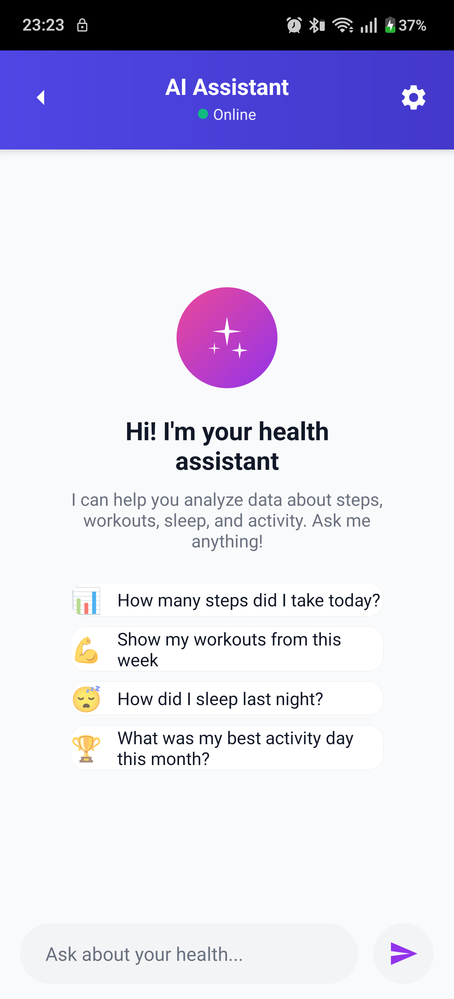
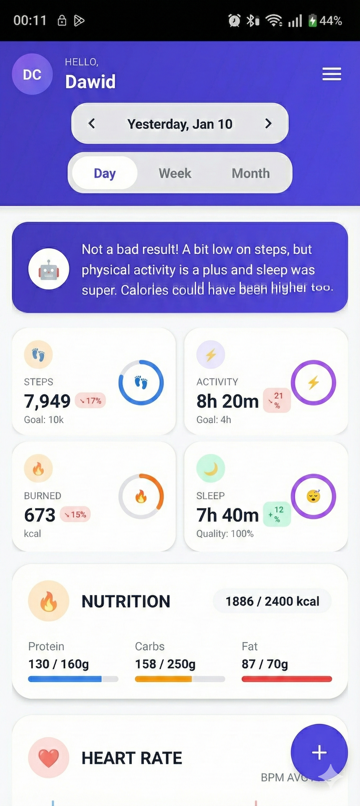
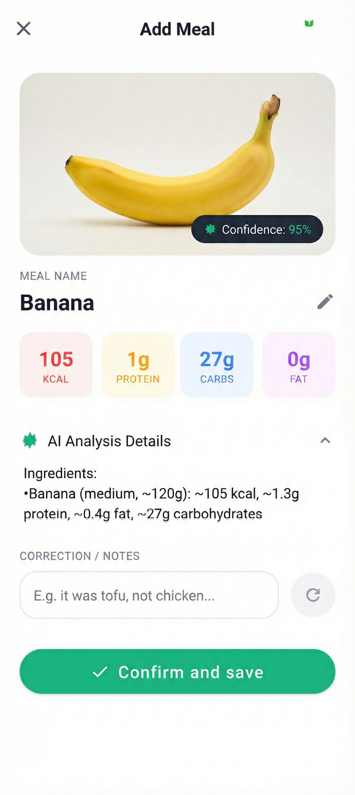
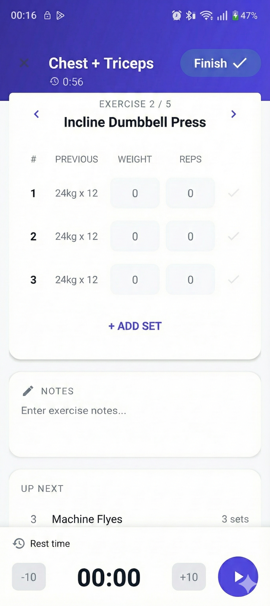

# Health Assistant Server
[](https://sonarcloud.io/summary/new_code?id=Dawid-Cisowski_Health-Assistant-Server)
<p align="center">
  
</p>


Backend server for managing health data with Health Connect integration, AI assistant, and meal/workout tracking.

**Tech Stack**: Java 21 + Spring Boot 4.0.2 + PostgreSQL 16 + Spring AI 2.0 (Gemini) + Spring Modulith

## Features

### AI Health Assistant

<p align="center">
  
</p>

- **Natural Language**: "How many steps did I take today?", "How did I sleep this week?"
- **Conversation History**: Multi-turn with context (last 20 messages)
- **Date Recognition**: "today", "yesterday", "last week", "last month"
- **SSE Streaming**: Real-time word-by-word responses
- **18 AI Tools** (11 read + 7 mutation): Steps, sleep, workouts, meals, daily summaries, weight, body measurements, energy requirements + record/update/delete via chat
- **Mutation via Chat**: "Ate chicken with rice for lunch, 500 kcal", "Record my weight 82.5 kg", "Delete today's breakfast"
- **Gemini 3 Flash**: Google's latest model with function calling

### Event Sourcing & Projections

<p align="center">
  
</p>

- **Append-only Event Log**: All data as immutable events in PostgreSQL
- **12 Event Types**: Steps, Sleep, Workout, Meal, HeartRate, Distance, WalkingSession, ActiveMinutes, ActiveCalories, Weight, RestingHeartRate, BodyMeasurement
- **9 Projections**: Steps, Sleep, Workout, Calories, Activity, Meals, Weight, HeartRate, BodyMeasurements
- **Optimistic Locking**: `@Version` on all entities with automatic retry
- **Idempotency**: Deduplication via `idempotency_key`

### AI-Powered Import (Vision)

<p align="center">
  
</p>

- **Sleep Import**: Screenshot from oHealth → AI extraction → SleepSessionRecorded
- **Workout Import**: Screenshot from GymRun → AI extraction → WorkoutRecorded
- **Meal Import**: Meal photo → AI analysis → Draft → Confirm → MealRecorded
- **Weight Import**: Screenshot from scale app → AI extraction → WeightMeasured

### Workout & Exercise Tracking

<p align="center">
  
</p>

- **59 Exercises in Catalog**: Complete list with muscle groups
- **Exercise Statistics**: Progression stats for each exercise
- **Workout Routines**: Training templates with default sets
- **Volume Tracking**: Total volume, working volume, max weights

### Security
- **HMAC-SHA256 Authentication**: Signature on every request
- **Replay Protection**: Nonce cache with TTL
- **Log Sanitization**: Protection against log injection
- **Prompt Injection Protection**: AI message validation
- **AI Guardrails**: Content filtering and safety checks
- **Constant-time Signature Verification**: Protection against timing attacks

## Architecture

### 23 Modules (Spring Modulith)

```
com.healthassistant/
├── appevents/       # Event submission API
├── healthevents/    # Event store, validation, idempotency
├── dailysummary/    # Daily aggregations + AI summary
├── steps/           # Steps projections (hourly → daily)
├── sleep/           # Sleep projections
├── sleepimport/     # AI sleep import from screenshots
├── workout/         # Workout projections, exercises, routines
├── workoutimport/   # AI workout import
├── calories/        # Calories projections (hourly → daily)
├── activity/        # Activity projections
├── meals/           # Meal projections
├── mealimport/      # AI meal import (draft flow)
├── weight/          # Weight measurement projections
├── weightimport/    # AI weight import from screenshots
├── heartrate/       # Heart rate projections (summary + resting)
├── bodymeasurements/ # Body measurements (body fat, muscle mass)
├── guardrails/      # AI safety guardrails and content filtering
├── assistant/       # AI chat with Gemini (18 tools: read + mutation)
├── notifications/   # FCM push notifications (daily/weekly/monthly)
├── reports/         # Health reports generation
├── googlefit/       # Historical sync with Google Fit
├── security/        # HMAC filter, nonce cache
└── config/          # Configuration, exception handling
```

### Event Flow

```
POST /v1/health-events
    ↓
HealthEventsController
    ↓
StoreHealthEventsCommandHandler
    ├── EventValidator (payload validation)
    ├── EventRepository (save/update)
    ├── Spring Modulith Events
    │   ├── StepsProjector
    │   ├── SleepProjector
    │   ├── WorkoutProjector
    │   ├── CaloriesProjector
    │   ├── ActivityProjector
    │   ├── MealsProjector
    │   ├── WeightProjector
    │   ├── HeartRateProjector
    │   └── BodyMeasurementsProjector
    └── DailySummaryAggregator
```

## API Endpoints

### AI Assistant
| Method | Endpoint | Description |
|--------|----------|-------------|
| POST | `/v1/assistant/chat` | Chat SSE streaming |

### Health Events
| Method | Endpoint | Description |
|--------|----------|-------------|
| POST | `/v1/health-events` | Batch event ingestion (max 100) |

### Daily Summaries
| Method | Endpoint | Description |
|--------|----------|-------------|
| GET | `/v1/daily-summaries/{date}` | Daily summary |
| GET | `/v1/daily-summaries/range` | Date range summaries |
| GET | `/v1/daily-summaries/{date}/ai-text` | AI-generated summary text |

### Steps
| Method | Endpoint | Description |
|--------|----------|-------------|
| GET | `/v1/steps/daily/{date}` | Hourly breakdown |
| GET | `/v1/steps/range` | Range with daily stats |

### Sleep
| Method | Endpoint | Description |
|--------|----------|-------------|
| GET | `/v1/sleep/daily/{date}` | Sleep sessions for day |
| GET | `/v1/sleep/range` | Range with daily stats |
| POST | `/v1/sleep/import-image` | AI import from screenshot |

### Workouts
| Method | Endpoint | Description |
|--------|----------|-------------|
| GET | `/v1/workouts/{workoutId}` | Workout details |
| GET | `/v1/workouts` | Workout list (date range) |
| POST | `/v1/workouts/import-image` | AI import from screenshot |

### Exercise Catalog
| Method | Endpoint | Description |
|--------|----------|-------------|
| GET | `/v1/workouts/exercises` | All 59 exercises |
| GET | `/v1/workouts/exercises/muscles` | List of muscle groups |
| GET | `/v1/workouts/exercises/muscle/{muscle}` | Exercises for muscle group |
| GET | `/v1/exercises/{id}/statistics` | Progression statistics |

### Routines
| Method | Endpoint | Description |
|--------|----------|-------------|
| GET | `/v1/routines` | User's routine list |
| GET | `/v1/routines/{id}` | Routine details |
| POST | `/v1/routines` | Create routine |
| PUT | `/v1/routines/{id}` | Update routine |
| DELETE | `/v1/routines/{id}` | Delete routine |

### Calories
| Method | Endpoint | Description |
|--------|----------|-------------|
| GET | `/v1/calories/daily/{date}` | Hourly breakdown |
| GET | `/v1/calories/range` | Range with daily stats |

### Activity
| Method | Endpoint | Description |
|--------|----------|-------------|
| GET | `/v1/activity/daily/{date}` | Hourly breakdown |
| GET | `/v1/activity/range` | Range with daily stats |

### Meals
| Method | Endpoint | Description |
|--------|----------|-------------|
| GET | `/v1/meals/daily/{date}` | Meals for day |
| GET | `/v1/meals/range` | Meals range |
| POST | `/v1/meals` | Add meal |
| PUT | `/v1/meals/{eventId}` | Edit meal |
| DELETE | `/v1/meals/{eventId}` | Delete meal |
| POST | `/v1/meals/import` | AI import (quick) |
| POST | `/v1/meals/import/analyze` | AI draft creation |
| PATCH | `/v1/meals/import/{draftId}` | Update draft |
| POST | `/v1/meals/import/{draftId}/confirm` | Confirm draft |

### Weight
| Method | Endpoint | Description |
|--------|----------|-------------|
| GET | `/v1/weight/latest` | Latest weight measurement |
| GET | `/v1/weight/range` | Weight measurements in range |
| POST | `/v1/weight/import-image` | AI import from screenshot |

### Heart Rate
| Method | Endpoint | Description |
|--------|----------|-------------|
| GET | `/v1/heartrate/range` | Heart rate data in range |

### Google Fit (Legacy)
| Method | Endpoint | Description |
|--------|----------|-------------|
| POST | `/v1/google-fit/sync/day` | Historical sync (up to 5 years) |

### Admin
| Method | Endpoint | Description |
|--------|----------|-------------|
| POST | `/v1/admin/reproject` | Rebuild projections |

## Event Types

| Event Type | Fields | Validation |
|------------|--------|------------|
| `StepsBucketedRecorded.v1` | bucketStart, bucketEnd, count | count ≥ 0 |
| `HeartRateSummaryRecorded.v1` | bucketStart, bucketEnd, avg, min, max, samples | metrics ≥ 0 |
| `SleepSessionRecorded.v1` | sleepStart, sleepEnd, totalMinutes, stages | minutes ≥ 0 |
| `ActiveCaloriesBurnedRecorded.v1` | bucketStart, bucketEnd, energyKcal | kcal ≥ 0 |
| `ActiveMinutesRecorded.v1` | bucketStart, bucketEnd, activeMinutes | minutes ≥ 0 |
| `DistanceBucketedRecorded.v1` | bucketStart, bucketEnd, distanceMeters | meters ≥ 0 |
| `WalkingSessionRecorded.v1` | sessionId, start, end, durationMinutes | duration ≥ 0 |
| `WorkoutRecorded.v1` | workoutId, performedAt, exercises[] | exercises non-empty |
| `MealRecorded.v1` | title, mealType, macros, healthRating | macros ≥ 0 |
| `WeightMeasured.v1` | weightKg, measuredAt | weightKg > 0 |
| `RestingHeartRateRecorded.v1` | measuredAt, beatsPerMinute | bpm > 0 |
| `BodyMeasurementRecorded.v1` | measuredAt, bodyFatPercent, muscleMassKg | values > 0 |

**Meal Types**: BREAKFAST, BRUNCH, LUNCH, DINNER, SNACK, DESSERT, DRINK

**Health Ratings**: VERY_HEALTHY, HEALTHY, NEUTRAL, UNHEALTHY, VERY_UNHEALTHY

## Database Schema

### 48 Flyway Migrations (V1-V48)

**Core Tables**:
- `health_events` - Event log (JSONB payload, GIN index, version)
- `daily_summaries` - Daily aggregates (JSONB, ai_summary_cache, device_id)
- `conversations` - AI conversation history
- `conversation_messages` - Messages in conversations

**Projection Tables** (all with `version` for optimistic locking):
- `steps_hourly_projections`, `steps_daily_projections`
- `sleep_sessions_projections`, `sleep_daily_projections`
- `workout_projections`, `workout_exercise_projections`, `workout_set_projections`
- `calories_hourly_projections`, `calories_daily_projections`
- `activity_hourly_projections`, `activity_daily_projections`
- `meal_projections`, `meal_daily_projections`
- `weight_measurement_projections`
- `heart_rate_projections`, `resting_heart_rate_projections`
- `body_measurement_projections`

**Domain Tables**:
- `exercises` - Catalog of 59 exercises
- `exercise_name_mappings` - AI matching names → catalog IDs
- `routines`, `routine_exercises` - Workout templates
- `meal_import_drafts` - AI draft flow for meals

## Configuration

### Required
```bash
export DB_URL=jdbc:postgresql://localhost:5432/health_assistant
export DB_USER=postgres
export DB_PASSWORD=postgres
export HMAC_DEVICES_JSON='{"device-id":"base64-secret"}'
```

### Optional
```bash
export HMAC_TOLERANCE_SEC=600          # Timestamp tolerance (default: 600)
export NONCE_CACHE_TTL_SEC=600         # Nonce cache TTL (default: 600)
export GEMINI_API_KEY=your-key         # For AI Assistant
export GEMINI_MODEL=gemini-3-flash-preview
export GOOGLE_FIT_CLIENT_ID=...        # For historical sync
export GOOGLE_FIT_CLIENT_SECRET=...
export GOOGLE_FIT_REFRESH_TOKEN=...
```

## Quick Start

### Docker Compose (Recommended)
```bash
docker-compose up --build
```

### Local Development
```bash
# Start PostgreSQL
docker run --name postgres-dev \
  -e POSTGRES_DB=health_assistant \
  -e POSTGRES_USER=postgres \
  -e POSTGRES_PASSWORD=postgres \
  -p 5432:5432 \
  -d postgres:16-alpine

# Run application
./gradlew bootRun
```

### Endpoints
- Swagger UI: http://localhost:8080/swagger-ui.html
- Health: http://localhost:8080/actuator/health
- Metrics: http://localhost:8080/actuator/prometheus

## Testing

```bash
# All tests
./gradlew build

# Integration tests only
./gradlew :integration-tests:test

# Specific test
./gradlew :integration-tests:test --tests "*WorkoutSpec*"

# Test report
open integration-tests/build/reports/tests/test/index.html
```

### Integration Tests (77 Spec Files)
- **Event Validation**: Steps, Sleep, Workout, Meal, HeartRate, Distance, WalkingSession, ActiveMinutes, ActiveCalories, Weight
- **Projections**: Steps, Sleep, Workout, Calories, Activity, Meals, Weight, ExerciseStatistics, PersonalRecords
- **Features**: DailySummary, Assistant, AssistantMutationTools, ConversationHistory, GoogleFitSync, HmacAuthentication, BatchEventIngestion, Routines, MealCrud, WorkoutCrud
- **Import**: WorkoutImport, MealImport, SleepImport, MealImportDraft, MealImportEdgeCases
- **AI Evaluation**: Hallucination, ToolErrorHandling, ConversationAccuracy, ContentFiltering, PromptInjection, StreamErrorRecovery, ConcurrentRequests, MultiToolQuery, MutationTools, DailySummaryEvaluation
- **AI Import**: WorkoutImportAI, SleepImportAI, MealImportAI, WeightImportAI
- **Security**: HmacAuthentication, EventSecurity, GlobalExceptionHandler, RateLimiting, Guardrails
- **Concurrency**: OptimisticLocking
- **AI Features**: AiDailySummary, AiDailySummaryCache
- **Cross-cutting**: TimezoneBoundary, CrossModuleConsistency, EventCorrection, EventDeletion
- **Benchmarks**: AiBenchmark, AiMutationBenchmark

## Tech Stack

| Category | Technology |
|----------|------------|
| Language | Java 21 (Virtual Threads) |
| Framework | Spring Boot 4.0.2 |
| AI | Spring AI 2.0.0-M2 + Gemini 3 Flash |
| Architecture | Spring Modulith 2.0.1 |
| Database | PostgreSQL 16 (JSONB) |
| Migrations | Flyway |
| Build | Gradle 8.5+ (Kotlin DSL) |
| Caching | Caffeine |
| HTTP Client | OpenFeign |
| Mapping | MapStruct |
| Testing | Spock + Testcontainers + REST Assured |
| Quality | SpotBugs + PMD + JaCoCo |
| Container | Docker + Docker Compose |

## HMAC Authentication

All `/v1/*` endpoints require HMAC signature.

### Headers
```
X-Device-Id: device-identifier
X-Timestamp: 2026-01-07T12:00:00Z
X-Nonce: random-unique-string
X-Signature: hmac-sha256-signature
```

### Signature Calculation
```
canonical = METHOD + "\n" + PATH + "\n" + TIMESTAMP + "\n" + NONCE + "\n" + DEVICE_ID + "\n" + BODY
signature = HMAC-SHA256(canonical, device_secret)
```

## Key Design Principles

1. **Events as Source of Truth** - Immutable event log, regenerable projections
2. **Idempotency** - Safe retry via idempotency_key
3. **Eventual Consistency** - Projection failures don't block ingestion
4. **Optimistic Locking** - @Version on all entities
5. **Module Boundaries** - Package-private + public facades
6. **Modern Java 21** - Records, Stream API, Pattern Matching, Virtual Threads
7. **Security First** - HMAC, log sanitization, prompt injection protection

## Monitoring

```bash
# Health check
curl http://localhost:8080/actuator/health

# Prometheus metrics
curl http://localhost:8080/actuator/prometheus
```

**Key Metrics**:
- `http_server_requests_seconds` - Request latency
- `jvm_memory_used_bytes` - Memory usage
- `jdbc_connections_active` - DB connections
- `cache_gets_total` - Cache hits/misses

---

**Built with Java 21 + Spring Boot 4.0.2 + Spring AI 2.0**

Copyright 2026. All rights reserved.
